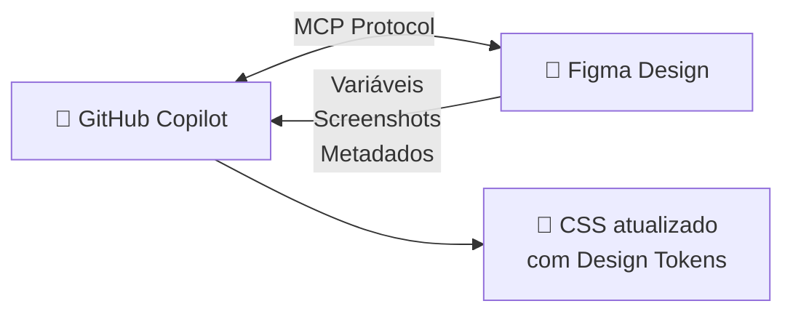

# Step 1: Configurar Figma MCP

_Conecte o GitHub Copilot ao Figma usando o protocolo MCP_ ⚡

## Teoria: O que é o Figma MCP?

No exercício anterior, você usou o **GitHub MCP** para conectar o Copilot ao GitHub. Agora vamos conectá-lo ao **Figma** — a ferramenta de design mais popular do mercado.

O **Figma MCP** expõe diversas ferramentas que o Copilot pode chamar:

| Ferramenta | O que faz |
|-----------|----------|
| `whoami` | Verifica a conexão e retorna seu usuário Figma |
| `get_variable_defs` | Extrai variáveis (cores, tipografia, espaçamento) de um arquivo |
| `get_design_context` | Retorna screenshot + metadados estruturados de um componente/página |
| `get_metadata` | Retorna informações gerais sobre um arquivo Figma |



Neste exercício, vamos usar essas ferramentas para **redesenhar o site do Mergington High School** com base no **Simple Design System** do Figma.

---

## Atividade

### 1.1 — Criar uma conta no Figma (se ainda não tem)

1. Acesse [figma.com/signup](https://www.figma.com/signup)
2. Crie uma conta (pode usar Google ou GitHub)
3. A conta gratuita (**Starter**) é suficiente para este exercício

### 1.2 — Duplicar o Simple Design System

O **Simple Design System** é um design system oficial da Figma, ideal para aprender. Você vai criar uma cópia pessoal:

1. Acesse o arquivo original na comunidade Figma:
   👉 [Simple Design System](https://www.figma.com/community/file/1380235722331273046/simple-design-system)
2. Clique no botão **"Open in Figma"**
3. O Figma criará uma cópia na sua conta
4. No arquivo duplicado, copie o **file key** da URL:

   ```
   https://www.figma.com/design/XXXXXXX/Simple-Design-System
                                 ───────
                                 ▲ este é o seu file key
   ```

5. **Guarde este file key** — você vai precisar dele nos próximos steps

### 1.3 — Gerar um Personal Access Token no Figma

O Copilot precisa de um token para acessar seus arquivos Figma via MCP.

1. Acesse [figma.com/developers/apps](https://www.figma.com/developers/apps)
2. Na seção **Personal access tokens**, clique em **Generate new token**
3. Configure o token:
   - **Nome:** `copilot-mcp` (ou outro nome descritivo)
   - **Expiration:** escolha a validade desejada
   - **Scopes:** marque **File content** → **Read only**
4. Clique em **Generate token**
5. **Copie o token imediatamente** — ele só é exibido uma vez!

> ⚠️ **Segurança:** Nunca faça commit do token em repositórios. O VS Code vai solicitar o token de forma segura quando necessário.

### 1.4 — Ativar o Figma MCP no VS Code

O repositório já inclui um template de configuração MCP. Você só precisa ativá-lo:

1. No terminal do Codespace, execute:
   ```bash
   cp .vscode/mcp.json.example .vscode/mcp.json
   ```

2. Verifique o conteúdo do arquivo `.vscode/mcp.json`:
   ```json
   {
     "servers": {
       "figma": {
         "url": "https://mcp.figma.com/mcp",
         "type": "http",
         "headers": {
           "Authorization": "Bearer ${input:figma-token}"
         }
       }
     },
     "inputs": [
       {
         "id": "figma-token",
         "type": "promptString",
         "description": "Figma Personal Access Token",
         "password": true
       }
     ]
   }
   ```

   > O `${input:figma-token}` faz o VS Code solicitar seu token automaticamente quando o Copilot usar o MCP pela primeira vez.

### 1.5 — Testar a conexão com `whoami`

Hora de testar! Abra o **Copilot Agent Mode** e use a primeira ferramenta do Figma MCP:

1. Abra o Copilot Chat (ícone do Copilot na barra lateral → Agent)
2. Digite no chat:
   ```
   Use the Figma MCP whoami tool to verify my connection
   ```
3. O VS Code vai pedir seu **Figma Personal Access Token** — cole o token que você gerou
4. Se a conexão funcionar, o Copilot vai retornar seu nome de usuário/email do Figma

> 💡 **O que aconteceu?** O Copilot chamou a ferramenta `whoami` do Figma MCP. Essa é a forma mais simples de validar que a conexão está funcionando antes de usar ferramentas mais avançadas.

### 1.6 — Fazer commit e push

```bash
git add .vscode/mcp.json
git commit -m "feat: configure Figma MCP server"
git push origin main
```

---

## Validação

Depois do push, o workflow do exercício vai verificar:
- ✅ O arquivo `.vscode/mcp.json` existe
- ✅ O arquivo contém a configuração do servidor `mcp.figma.com`

Quando a validação passar, as instruções do **Step 2** aparecerão automaticamente na issue do exercício.
