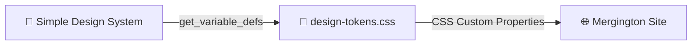

# Step 2: Extrair Design Tokens

_Use `get_variable_defs` para transformar variáveis do Figma em CSS_ 🎨

## Teoria: O que são Design Tokens?

**Design tokens** são os valores fundamentais de um design system — cores, tipografia, espaçamento, bordas. Eles são a "fonte única de verdade" que conecta design e código.

No Figma, esses valores são armazenados como **variáveis** (Variables). O Figma MCP expõe a ferramenta `get_variable_defs`, que extrai todas as variáveis de um arquivo de uma vez.

O plano é simples:



Vamos transformar essas variáveis em **CSS Custom Properties** que depois serão aplicadas no site do Mergington:

```css
/* Variáveis do Figma → CSS Custom Properties */
:root {
  --sds-color-background-default-default: #ffffff;
  --sds-color-text-default-default: #1e1e1e;
  --sds-color-border-default-default: #d9d9d9;
}
```

---

## Atividade

### 2.1 — Extrair variáveis do Figma com `get_variable_defs`

1. Abra o **Copilot Agent Mode**
2. Use o seguinte prompt (substituindo `SEU_FILE_KEY` pelo file key que você copiou no Step 1):

   ```
   Use the Figma MCP tool get_variable_defs to extract all design variables
   from my Figma file with key SEU_FILE_KEY.

   Then create the file src/tokens/design-tokens.css with all the variables
   as CSS Custom Properties inside a :root selector.
   Use the variable names from Figma as the CSS property names.
   ```

3. O Copilot vai:
   - Chamar `get_variable_defs` no Figma via MCP
   - Receber todas as variáveis do Simple Design System (cores, tipografia, etc.)
   - Gerar o arquivo CSS com as custom properties

> 💡 **O que aconteceu?** A ferramenta `get_variable_defs` retorna a lista completa de variáveis definidas no arquivo Figma — nomes, valores e coleções. O Copilot então as transforma no formato CSS que precisamos.

### 2.2 — Verificar os tokens gerados

Abra o arquivo `src/tokens/design-tokens.css` e verifique se ele contém variáveis como:

```css
:root {
  /* Backgrounds */
  --sds-color-background-default-default: #ffffff;
  --sds-color-background-default-secondary: #f5f5f5;
  --sds-color-background-brand-default: #2c2c2c;

  /* Text */
  --sds-color-text-default-default: #1e1e1e;
  --sds-color-text-default-secondary: #757575;

  /* Borders */
  --sds-color-border-default-default: #d9d9d9;
  --sds-color-border-brand-default: #2c2c2c;

  /* ... e mais variáveis */
}
```

> 💡 Os valores exatos podem variar ligeiramente dependendo da sua cópia do Design System. O importante é que os nomes das variáveis sigam o padrão `--sds-*`.

### 2.3 — Fazer commit e push

```bash
git add src/tokens/design-tokens.css
git commit -m "feat: extract design tokens from Figma via MCP"
git push origin main
```

---

## Validação

Depois do push, o workflow do exercício vai verificar:
- ✅ O arquivo `src/tokens/design-tokens.css` existe
- ✅ O arquivo contém `--sds-color-background-default-default`
- ✅ O arquivo contém `--sds-color-text-default-default`

Quando a validação passar, as instruções do **Step 3** aparecerão automaticamente na issue do exercício.
