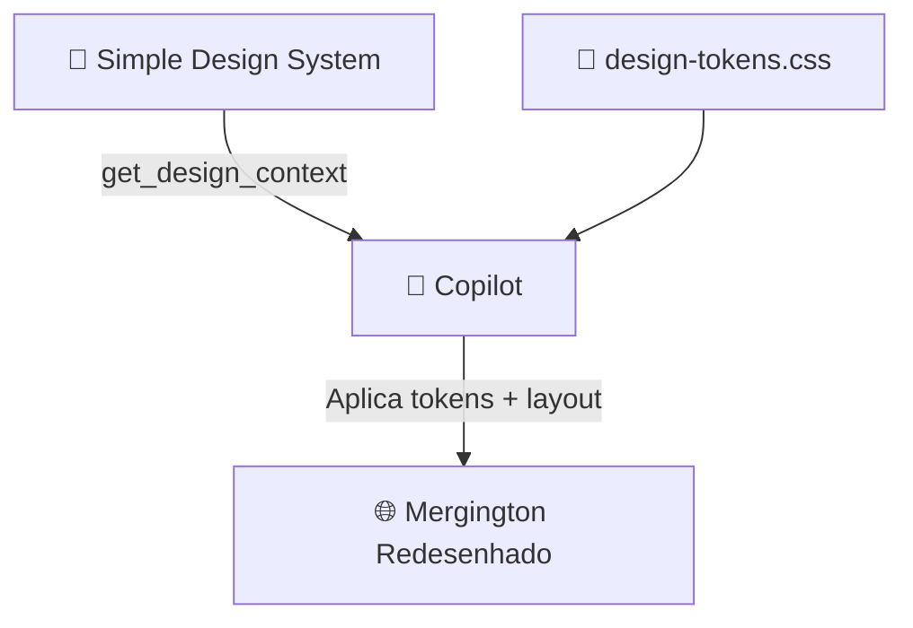

# Step 3: Redesenhar o Mergington

_Use `get_design_context` para aplicar o Design System ao site existente_ 🚀

## Teoria: Do Design System ao Código

Você já extraiu os **design tokens** no Step 2. Agora vamos usar outra ferramenta poderosa do Figma MCP: `get_design_context`.

Essa ferramenta retorna:
- Um **screenshot** do componente/página selecionada
- **Metadados estruturados** (layout, cores, tipografia, espaçamento)
- **Hints** de código quando disponíveis

Com isso, o Copilot consegue "ver" o design e aplicar as mudanças no código existente — sem você precisar traduzir manualmente cada detalhe visual.



---

## Atividade

### 3.1 — Criar uma branch

```bash
git checkout -b redesign/design-system
```

### 3.2 — Importar os design tokens no site

Primeiro, conecte os tokens ao site. Abra `src/static/index.html` e adicione o link para o CSS de tokens no `<head>`:

```html
<link rel="stylesheet" href="../tokens/design-tokens.css" />
```

> Isso torna todas as variáveis `--sds-*` disponíveis para uso no `styles.css`.

### 3.3 — Pedir ao Copilot para redesenhar com `get_design_context`

Agora vem a parte divertida! Abra o **Copilot Agent Mode** e use o seguinte prompt (substituindo `SEU_FILE_KEY`):

```
Use the Figma MCP tool get_design_context with file key SEU_FILE_KEY
and node ID 175:4613 to see the home page design from the Simple Design System.

Now look at the current Mergington High School site in src/static/styles.css
and src/static/index.html.

Redesign the site to match the visual style from the Figma design:
- Replace the hardcoded colors in styles.css with the CSS custom properties
  from src/tokens/design-tokens.css (e.g., use var(--sds-color-*) instead of #1a237e)
- Update the typography, spacing, and border-radius to follow the design system
- Keep the same HTML structure and functionality — only change the visual appearance

Do NOT change src/app.py or src/static/app.js.
```

O Copilot vai:
1. Chamar `get_design_context` e receber o screenshot + metadados do design
2. Ler o CSS atual do Mergington e os design tokens disponíveis
3. Substituir valores hardcoded por variáveis `--sds-*`
4. Ajustar tipografia, espaçamento e bordas para seguir o design system

> 💡 **O que aconteceu?** O `get_design_context` deu ao Copilot uma referência visual real do design. Com isso + os tokens do Step 2, ele consegue fazer substituições precisas no CSS sem inventar valores.

### 3.4 — Conferir o resultado

Inicie o servidor e veja o redesign em ação:

```bash
pip install fastapi uvicorn
uvicorn src.app:app --reload
```

Acesse `http://localhost:8000` e compare o antes e depois. As cores, fontes e espaçamentos devem seguir o Design System.

Se quiser ajustes, continue conversando com o Copilot:

```
The header background should use var(--sds-color-background-brand-default)
and the text on it should use var(--sds-color-text-brand-on-brand).
Fix that in styles.css.
```

### 3.5 — Commit, push e abrir PR

```bash
git add .
git commit -m "feat: redesign Mergington with Figma Design System tokens"
git push origin redesign/design-system
```

Abra um **Pull Request** de `redesign/design-system` → `main`:
1. Acesse a aba **Pull Requests** do repositório
2. Clique em **New pull request**
3. Selecione `redesign/design-system` como branch de origem
4. Título sugerido: `feat: Redesign Mergington with Simple Design System`

---

## Validação

Depois de abrir o PR, o workflow do exercício vai verificar:
- ✅ O arquivo `src/static/styles.css` foi modificado
- ✅ O CSS contém referências a design tokens (`--sds-color`)

Quando a validação passar, as instruções do **Step 4** aparecerão automaticamente na issue do exercício.
